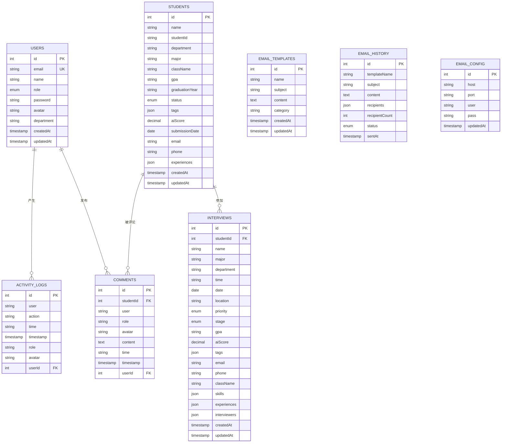

# 数据库表关系文档
## 操作
```TS
测试数据库是否链接成功： npx tsx scripts/test-db.ts
在 schema.ts 中定义 students 表结构；
执行 npm run db:generate 生成迁移文件；
执行 npm run db:migrate 将表结构同步到数据库；
执行 npm run db:studio 可视化验证表是否创建成功；

```
## 概述
本文档展示简历筛选系统中 8 个数据库表的结构和它们之间的关系。

## 表结构总览

```
┌─────────────────────────────────────────────────────────────────────────────┐
│                           数据库表关系图                                     │
├─────────────────────────────────────────────────────────────────────────────┤
│                                                                             │
│    ┌──────────┐         ┌──────────────┐                                    │
│    │  users   │ 1    *  │ activityLogs │                                    │
│    └────┬─────┘─────────└──────────────┘                                    │
│         │                                                                   │
│         │ 1    *  ┌──────────┐                                             │
│         └─────────│ comments │                                             │
│                   └────┬─────┘                                             │
│                        │ 1                                                  │
│                        │     1    *  ┌────────────┐                        │
│                        └─────────────│ interviews │                        │
│                                     └─────┬──────┘                        │
│                                           │                                 │
│                                     1    │                                 │
│                                     ┌────┴─────┐                           │
│                                     │ students │                           │
│                                     └──────────┘                           │
│                                                                             │
│    ┌─────────────────┐    ┌────────────────┐    ┌─────────────────┐       │
│    │  emailTemplates │    │  emailHistory  │    │  emailConfig   │       │
│    └─────────────────┘    └────────────────┘    └─────────────────┘       │
│           (独立)                  (独立)                  (独立)           │
│                                                                             │
└─────────────────────────────────────────────────────────────────────────────┘
```

## 8 个数据库表

### 1. users (用户表)
存储系统用户信息。

| 字段 | 类型 | 说明 |
|------|------|------|
| id | serial | 主键，自增 |
| email | varchar(255) | 邮箱，唯一 |
| name | varchar(255) | 用户名 |
| role | enum | 角色: `admin`, `member` |
| password | varchar(255) | 密码 |
| avatar | varchar(500) | 头像 URL |
| department | varchar(255) | 部门 |
| createdAt | timestamp | 创建时间 |
| updatedAt | timestamp | 更新时间 |

### 2. students (学生/简历表)
存储候选人简历信息。

| 字段 | 类型 | 说明 |
|------|------|------|
| id | serial | 主键，自增 |
| name | varchar(255) | 姓名 |
| studentId | varchar(50) | 学号 |
| department | varchar(255) | 院系 |
| major | varchar(255) | 专业 |
| className | varchar(100) | 班级 |
| gpa | varchar(10) | GPA |
| graduationYear | varchar(10) | 毕业年份 |
| status | enum | 状态 |
| tags | json | 标签数组 |
| aiScore | decimal | AI 评分 |
| submissionDate | date | 提交日期 |
| email | varchar(255) | 邮箱 |
| phone | varchar(50) | 电话 |
| experiences | json | 经历数组 |
| createdAt | timestamp | 创建时间 |
| updatedAt | timestamp | 更新时间 |

**状态枚举**: `pending` | `to_be_scheduled` | `pending_interview` | `interviewing` | `passed` | `rejected`

### 3. interviews (面试表)
存储面试安排信息。

| 字段 | 类型 | 说明 |
|------|------|------|
| id | serial | 主键，自增 |
| studentId | int | 关联学生 ID (外键) |
| name | varchar(255) | 面试者姓名 |
| major | varchar(255) | 专业 |
| department | varchar(255) | 院系 |
| time | varchar(50) | 面试时间 |
| date | date | 面试日期 |
| location | varchar(255) | 面试地点 |
| priority | enum | 优先级 |
| stage | enum | 面试阶段 |
| gpa | varchar(10) | GPA |
| aiScore | decimal | AI 评分 |
| tags | json | 标签数组 |
| email | varchar(255) | 邮箱 |
| phone | varchar(50) | 电话 |
| className | varchar(100) | 班级 |
| skills | json | 技能数组 |
| experiences | json | 经历数组 |
| interviewers | json | 面试官数组 |
| createdAt | timestamp | 创建时间 |
| updatedAt | timestamp | 更新时间 |

**优先级枚举**: `low` | `medium` | `high`  
**阶段枚举**: `pending` | `to_be_scheduled` | `pending_interview` | `interviewing` | `passed` | `rejected`

### 4. comments (评论表)
存储简历评论信息。

| 字段 | 类型 | 说明 |
|------|------|------|
| id | serial | 主键，自增 |
| studentId | int | 关联学生 ID (外键) |
| user | varchar(255) | 评论者名称 |
| role | varchar(100) | 评论者角色 |
| avatar | varchar(500) | 评论者头像 |
| content | text | 评论内容 |
| time | varchar(50) | 显示用时间字符串 |
| timestamp | timestamp | 时间戳 |
| userId | int | 关联用户 ID (外键，可选) |

### 5. activityLogs (活动日志表)
记录系统活动日志。

| 字段 | 类型 | 说明 |
|------|------|------|
| id | serial | 主键，自增 |
| user | varchar(255) | 操作者名称 |
| action | varchar(500) | 操作描述 |
| time | varchar(50) | 显示用时间字符串 |
| timestamp | timestamp | 操作时间戳 |
| role | varchar(100) | 操作者角色 |
| avatar | varchar(500) | 操作者头像 |
| userId | int | 关联用户 ID (外键，可选) |

### 6. emailTemplates (邮件模板表)
存储邮件模板。

| 字段 | 类型 | 说明 |
|------|------|------|
| id | serial | 主键，自增 |
| name | varchar(255) | 模板名称 |
| subject | varchar(500) | 邮件主题 |
| content | text | 邮件内容 |
| category | varchar(100) | 模板分类 |
| createdAt | timestamp | 创建时间 |
| updatedAt | timestamp | 更新时间 |

### 7. emailHistory (邮件历史表)
记录邮件发送历史。

| 字段 | 类型 | 说明 |
|------|------|------|
| id | serial | 主键，自增 |
| templateName | varchar(255) | 使用的模板名称 |
| subject | varchar(500) | 邮件主题 |
| content | text | 邮件内容 |
| recipients | json | 收件人数组 |
| recipientCount | int | 收件人数量 |
| status | enum | 发送状态 |
| sentAt | timestamp | 发送时间 |

**状态枚举**: `success` | `failed` | `partial`

### 8. emailConfig (邮件配置表)
存储邮件服务器配置。

| 字段 | 类型 | 说明 |
|------|------|------|
| id | serial | 主键，自增 |
| host | varchar(255) | SMTP 服务器 |
| port | varchar(10) | 端口 |
| user | varchar(255) | 用户名 |
| pass | varchar(255) | 密码 |
| updatedAt | timestamp | 更新时间 |

---

## 表关系详解

### 1. users ↔ activityLogs (一对多)
```
users (1) ──────< activityLogs (*)
```
- 一个用户可以产生多条活动日志
- `activityLogs.userId` 关联 `users.id`

### 2. users ↔ comments (一对多)
```
users (1) ──────< comments (*)
```
- 一个用户可以发布多条评论
- `comments.userId` 关联 `users.id`

### 3. students ↔ comments (一对多)
```
students (1) ──────< comments (*)
```
- 一个学生/简历可以有多条评论
- `comments.studentId` 关联 `students.id`

### 4. students ↔ interviews (一对多)
```
students (1) ──────< interviews (*)
```
- 一个学生可以有多轮面试
- `interviews.studentId` 关联 `students.id`

### 5. emailTemplates, emailHistory, emailConfig (独立)
- 这三张表相互独立，没有外键关联
- `emailTemplates`: 存储可复用的邮件模板
- `emailHistory`: 记录已发送的邮件
- `emailConfig`: 存储 SMTP 配置

---

## 实体关系图 (ER Diagram)



---

## 业务场景说明

### 场景 1: 简历筛选流程
1. 学生提交简历 → `students` 表新增记录
2. HR/管理员查看简历 → 可在简历页面添加评论 → `comments` 表
3. AI 评分 → 更新 `students.aiScore`
4. 安排面试 → `interviews` 表新增记录
5. 面试结果更新 → 更新 `interviews.stage` 和 `students.status`

### 场景 2: 活动追踪
1. 用户登录/操作 → 记录到 `activityLogs`
2. HR 查看活动日志 → 了解团队成员操作历史

### 场景 3: 邮件通知
1. 管理员配置 SMTP → `emailConfig`
2. 创建邮件模板 → `emailTemplates`
3. 发送邮件 → `emailHistory` 记录发送历史
4. 候选人收到面试通知邮件

---

## 索引说明

| 表名 | 索引名 | 字段 |
|------|--------|------|
| comments | student_id_idx | studentId |
| students | status_idx | status |
| students | department_idx | department |
| interviews | student_id_idx | studentId |
| interviews | stage_idx | stage |
| interviews | date_idx | date |

这些索引用于提升查询性能，特别是在筛选和排序场景下。
